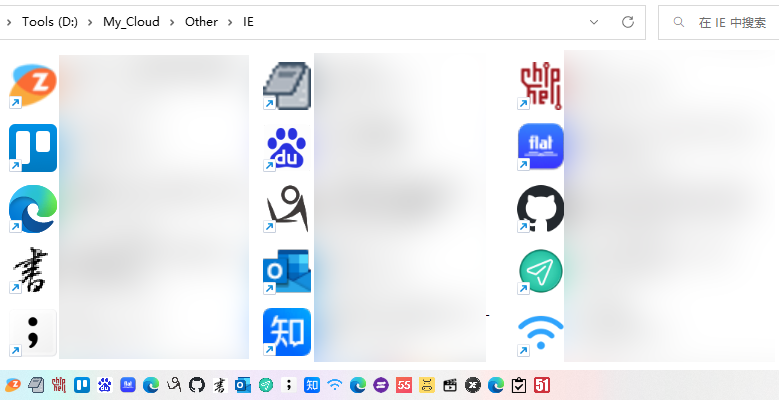

# url-Icon

.url shortcut add and down .ico

this repo can modify `.url` shortcut, download website `favicon.ico` to local.

if website icon is `.png` `.svg`... , this repo will convert it to `.ico(64x64)`

## use

### cli (recommended)

1. install nodejs `https://nodejs.org/`
2. `cmd` run command `npm i url-icon -g`
3. `cmd` run command `url-icon ${urlDir} ${iconDir}`

### script

1. install nodejs `https://nodejs.org/`
2. `cmd` to current dir
3. run `npm i` install dependencies
4. put `.url` into `input` dir, or change `config.js`
5. `npm run build`
6. (\*) refresh `explorer` icon cache

### refresh cache

In most cases, the explorer will refresh the cache and display it immediately. If there is an error, please try the following operation.

-   a. delete `%USERPROFILE%\AppData\Local\IconCache.db`
-   b. delete `%LOCALAPPDATA%\Microsoft\Windows\Explorer\` dir `thumbcache` and `iconcache`
-   c. run `ie4uinit.exe -ClearIconCache` and `ie4uinit.exe -show`
-   d. run `C:\WINDOWS\system32\cleanmgr.exe` clear `C:(windows dir)` icon cache options
-   e. reboot windows

I tested that the above `a.b.c.` had no effect, `d.e.` is ok.

#### manual

If you do not have any effect on the above operations, you can refer to the following article to try the manual method.

[URL desktop shortcuts & attaching permanent icons in Windows 7 \_ Delphin Systems (2023_3_11 11_07_53).html](<./docs/refreshCache/URL%20desktop%20shortcuts%20%26%20attaching%20permanent%20icons%20in%20Windows%207%20_%20Delphin%20Systems%20(2023_3_11%2011_07_53).html>)

#### need help

##### use command to run cleanmgr clean cache

`d.e.` can't run by command

If someone is good at win32 programming, you can try to compile the following code into `.exe`, and I can add it to the program to actively refresh the icon cache.

[如何刷新 explorer.exe 图标缓存 \_ 码农的日常 (2023_3_11 11_07_09).html](<./docs/refreshCache/%E5%A6%82%E4%BD%95%E5%88%B7%E6%96%B0explorer.exe%E5%9B%BE%E6%A0%87%E7%BC%93%E5%AD%98%20_%20%E7%A0%81%E5%86%9C%E7%9A%84%E6%97%A5%E5%B8%B8%20(2023_3_11%2011_07_09).html>)

##### IE Secret

I tested that the icon cache can be refreshed in real time by dragging. `.url` to the `IE(not edge)` address bar. Does anyone know what `IE` does behind it?

## Tips

-   `.url` local icon maybe not supported `.png`
-   `.url` local icon not supported `relative paths`

use taskbar to favorites

> if windows 11, you can use [ExplorerPatcher](https://github.com/valinet/ExplorerPatcher) to restore this feature of the taskbar ;)

